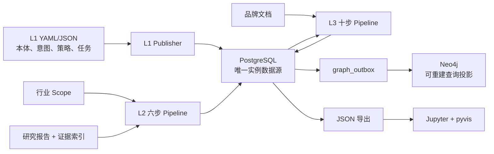
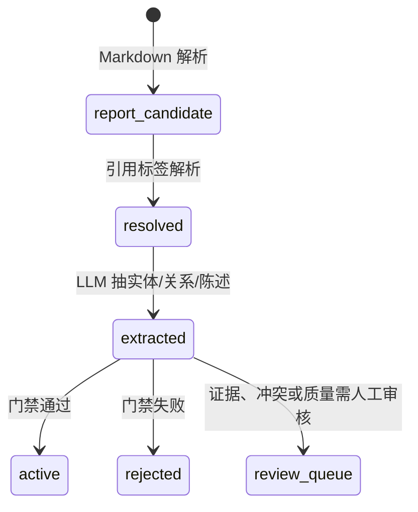

# Brand Atlas 数据逻辑、分层输入输出与运行手册

> 审查基线：`c3e6077`，审查日期：2026-08-12  
> 范围：L1 通用知识定义、L2 行业知识、L3 品牌知识、PostgreSQL、Neo4j 投影和可视化。

## 1. 当前结论

项目已经不只是“图谱设计文档”，而是进入了**可执行的知识入库和图投影阶段**：

| 能力 | 当前状态 | 判断 |
|---|---|---|
| L1 定义注册 | 已实现 | YAML/JSON 校验、发布器和 PostgreSQL Schema 可用 |
| L2 行业链路 | 部分可运行 | 六条执行器和 migration 已有；抽取依赖 LLM，证据和晋升治理仍需真实数据验收 |
| L3 品牌链路 | 部分可运行 | 十条执行器、11 张业务表、RLS 和快照已实现；需在真实租户资料上验收 |
| PostgreSQL 实例库 | 已实现 | 是 L2/L3 实例数据的唯一权威源 |
| Neo4j 图谱 | 已实现投影代码 | 可以从 PostgreSQL 全量重建或消费 active 数据 outbox；尚未在本次审查中连接真实 Neo4j 验收 |
| 图谱可视化 | 已实现 | PostgreSQL 可导出 JSON，Jupyter/pyvis 可展示 |
| L4 动态反馈 | 未实现 | 当前没有查询、LLM 输出和知识更新反馈事件执行器 |

因此准确表述是：**已经到图谱工程阶段，但还没有达到经过真实环境、真实数据和持续集成验证的生产级图谱系统阶段。**

## 2. 总体架构和权威数据源



权威关系如下：

1. `common_knowledge/`、`industry_knowledge/`、`brand_knowledge/` 中的 YAML/JSON 是**定义和契约源代码**。
2. `database/schema.sql`、`runtime/migrations/l2_migration.sql`、`brand_knowledge/database/brand_l3_migration.sql` 是**数据库结构权威源**。
3. PostgreSQL 是实体、关系、陈述、证据、租户和品牌实例的**唯一运行时权威源**。
4. Neo4j 只承担图查询投影，不应成为反向写入源；可以清空后从 PostgreSQL 重建。
5. `runtime/visualize/output/*.json` 和 notebook HTML 是展示产物，不是知识源。

## 3. 层间数据边界

| 层 | 主要输入 | 核心处理 | 主要输出 | 下游消费者 |
|---|---|---|---|---|
| L1 通用层 | 本体、意图、来源、策略、任务 YAML/JSON | Schema 校验、交叉引用校验、定义发布 | L1 注册表：实体类型、关系类型、意图、策略等 | L2/L3 抽取约束、审核规则 |
| L2 行业层 | 行业 scope、研究要求、报告、引用证据 | 需求编译、报告摄入、证据解析、实体/关系/陈述抽取、晋升 | 行业实体、关系、陈述、证据链 | Neo4j、可视化 |
| L3 品牌层 | 租户、品牌、品牌原始文档 | 文件门禁、解析分块、抽取、层内归一、分类、核证、审核 | 租户隔离的品牌实体、Assertion、证据、快照 | Neo4j、品牌问答/内容应用（后续） |
| 图投影层 | PostgreSQL active 数据或 outbox 事件 | 节点/关系 MERGE，全量重建或增量同步 | Neo4j 节点、边、Assertion 链 | Cypher 查询、图分析 |
| 展示层 | PostgreSQL 查询结果 | 过滤为子图、导出 JSON、pyvis 渲染 | 可交互 HTML 图 | 人工检查和探索 |

## 4. 跨层关键 ID

| ID | 含义 | 产生位置 | 传递方向 |
|---|---|---|---|
| `industry_id` | 行业业务标识 | scope | scope → requirement → entity 属性/筛选 |
| `requirement_id` | 一次行业研究合同 | requirement compilation | L2 第 1 步 → geo-research/report |
| `report_id` | 研究报告业务标识 | geo research job | 报告注册 → ingestion → extraction → promotion |
| `report_candidate.id` | 报告中的候选陈述 UUID | report ingestion | evidence resolution → extraction lineage → promotion |
| `entity.id` | PostgreSQL 权威实体 UUID | L2/L3 实体写入 | relation、statement、assertion、Neo4j |
| `entity.entity_id` | 人类可读业务 ID | 抽取/归一 | CLI、日志、外部引用；不能代替 UUID 外键 |
| `tenant_id` | L3 数据安全边界 | tenant | 所有 L3 RLS 表 |
| `brand_id` | 品牌锚点的 `entity.id` | brand context | L3 实体 owner、Assertion、映射和快照 |
| `document_id` | 文档业务标识 | source registration/executor | 布局解析 → 分块 → 候选抽取 |
| `snapshot_id` | 品牌知识发布快照 | review promotion | 版本审计和下游发布 |
| `graph_outbox.id` | 投影事件 ID | PostgreSQL 触发器/写入 | 增量 Neo4j 投影 |

业务 ID 用于接口和可读追踪，UUID 用于数据库外键。不要把品牌名称直接当 UUID 使用；可视化入口会先把 UUID、`entity_id` 或品牌名称解析成权威 UUID。

## 5. L1 通用知识层

### 5.1 输入

- `common_knowledge/ontology/*.yaml`：允许的实体和关系类型。
- `common_knowledge/intents/*.yaml`：意图、决策阶段和提问模式。
- `common_knowledge/sources/*.yaml`：来源类型和权威规则。
- `common_knowledge/policies/*.yaml`：事实/主张、冲突、晋升和上下文规则。
- `common_knowledge/tasks/*.yaml`：任务模板。
- 各层 `schemas/*.json` 与 examples：数据合同和回归样例。

### 5.2 处理与输出

`database/publish.py` 先验证 YAML/JSON、重复键、Schema 和交叉引用，再把定义发布到 `database/schema.sql` 创建的 L1 表。主要输出为：

- `entity_type`、`relation_type`
- `intent_definition`、`decision_stage`
- `source_policy`、`quality_rule`
- `task_template`、`example_case`
- `knowledge_definition`、`knowledge_version`

L1 不存具体品牌事实，也不存具体行业研究结果。它约束 L2/L3 可以抽取什么、如何分类和何时晋升。

## 6. L2 行业知识层

### 6.1 六步 Pipeline 输入输出

| 步骤 | CLI/文件输入 | 读取 | 写入 | 返回给下一步的输出 |
|---|---|---|---|---|
| 1 `requirement_compilation` | `--scope` YAML | `industry_scope`（可选 FK） | `industry_requirement` | `requirement_id`、`industry_id`、维度数、hash |
| 2 `geo_research_report_job` | `--report`，或 `--crawl --request/--requirement-id` | `industry_requirement` | `external_import_record`、`research_report` | `report_path`、`report_id`、报告 hash |
| 3 `report_ingestion` | `report_path`、`report_id` | `research_report`、Markdown | `report_section`、`report_candidate` | section/candidate 数 |
| 4 `evidence_resolution` | `--evidence` JSON | `report_candidate`、`evidence`、`source_instance` | `citation_resolution` | resolved/unresolved 数 |
| 5 `extraction` | `report_id` 候选，或 `--text/--report` | `report_candidate`、LLM | `entity`、`entity_alias`、`relation`、`statement`、`extraction_run` | run ID 和实体/关系/陈述数 |
| 6 `promotion` | `report_id`、置信阈值 | candidate、行业 requirement、L1 类型注册、source policy、证据链和 active 知识 | 持久化 10 道门禁结果；更新 candidate/entity/statement/relation 状态，必要时写 `review_queue` | promoted/rejected/queued 数 |

### 6.2 L2 实际数据状态流



报告候选通过 `report_candidate.id` 串起引用解析和抽取 lineage。由报告候选新产生的 `entity`、`statement`、`relation` 先写为 `candidate`，只有 promotion 通过后才改为 `active`；已有 active 实体不会被降级。直接使用 `--text` 或不带 `report_id` 的独立抽取没有这条候选证据链，适合调试，不应等同于完整治理流程。

### 6.3 L2 输入文件合同

Scope 至少需要 `industry_id`，常用字段包括：

```yaml
scope:
  request_id: industry_crm_software_cn_001
  industry_id: crm_software
  industry_name: CRM软件
  market: CN
  languages: [zh-CN]
```

证据索引由引用标签映射到来源和证据位置，逻辑结构示例：

```json
{
  "1": {
    "url": "https://example.com/report",
    "access_status": "verified",
    "support_status": "directly_supports",
    "page_ref": "p.12",
    "quote": "报告中的可核验原文片段",
    "source_id": "src_example",
    "source_class": "industry_research",
    "source_type": "academic",
    "evidence_id": "ev_example_12"
  }
}
```

`evidence_id` 和 `quote`（或 `evidence_text`）是形成可追溯证据对象的必要字段。`evidence_resolution` 会幂等创建缺失的 `source_instance/evidence`；只有 citation resolution 真实关联到 evidence UUID，promotion 的证据门禁才允许通过。

新导入来源固定登记为 `approval_status=pending, l2_enabled=false`，evidence JSON 不能自行批准来源。来源管理员核对域名、发布者、source class 和使用许可后，再执行批准：

```sql
UPDATE source_instance
SET approval_status='approved', l2_enabled=true
WHERE source_id='<source_id>';
```

批准前运行 promotion 会在 `gate_4_source` 拒绝该候选，这是预期的治理行为。

### 6.4 L2 使用方式

已有报告模式：

```powershell
python -m runtime.industry.executor --all `
  --scope "scopes/industry_crm软件_cn_001.yaml" `
  --report "D:\reports\crm.md" `
  --evidence "D:\reports\crm.evidence.json"
```

自动爬取模式：

```powershell
python -m runtime.industry.executor --all `
  --industry "CRM软件" --market CN `
  --crawl --request "研究中国 CRM 软件行业" `
  --evidence "D:\reports\crm.evidence.json"
```

当前 geo-research 桥接会寻找最新 Markdown 报告，但不会可靠地把所有抓取证据自动转换成本项目的 evidence index。因此生产运行前应把“爬取交付包 → evidence index”作为显式验收项。

### 6.5 L2 门禁与当前限制

当前 promotion 已执行真实数据库检查：行业 lineage、L1 实体类型、L1 关系方向/端点类型、来源白名单/权威等级/审批状态、证据支持、实体端点完整性、精确/近似重复、单值关系冲突、陈述分类和置信度。每个候选的 10 道结果写入 `report_candidate.promotion_gate_results`。

- 硬性失败（行业缺失、类型非法、来源未批准、证据不足等）进入 `rejected`。
- 近似重复、单值关系冲突、低置信度等不确定情况保持 `candidate` 并进入 `review_queue`。
- 精确重复直接拒绝；候选只与同一 `industry_id` 下的 promoted 知识比较。
- 新来源固定为 `pending/disabled`，必须由数据库管理员批准，输入文件不能自我授权。

每个非 dry-run Pipeline 由 `DB.transaction()` 包裹，任一步抛异常会回滚本步骤全部数据库写入。步骤间通过 `report_id/run_id` checkpoint 衔接，不使用跨六步流程的总事务。section、candidate、citation、statement、relation 和 review queue 已增加幂等唯一键，失败后可以安全重跑同一步。

事务边界由统一 executor 提供。生产和批处理必须通过 `python -m runtime.industry.executor` / `python -m runtime.brand.executor` 调用；直接执行 `runtime.industry.pipelines.*` 或 `runtime.brand.pipelines.*` 模块只用于调试，不具备 executor 的统一失败处理与事务包装。

仍需注意：

- 近似重复目前使用规范化文本字符相似度，适合作为人工审核召回，不等同于语义向量去重。
- 冲突自动检测目前覆盖 `one-to-one/many-to-one` 关系的“同主体同关系、不同对象”；自由文本中的数值、时间、地域和版本冲突仍需规则解析或人工审核。
- extraction 的 LLM 调用发生在 Pipeline 事务期间；大规模报告可能长时间占用一个数据库连接。数据量扩大后建议改为 staging 表或临时结果文件，再用短事务原子发布。
- LLM 输出质量取决于模型配置和报告质量，必须检查 `review_queue` 与抽取统计。
- `--all` 失败会立即停止并返回非零；外层调度应检查退出码。

## 7. L3 品牌认知层

### 7.1 十步 Pipeline 输入输出

所有步骤都需要 `--brand`，通常还应指定 `--tenant`。上下文解析得到 `tenant_id` 和品牌锚点 `brand_id`，并设置 PostgreSQL `app.tenant_id` 以启用 RLS。

| 步骤 | 主要输入 | 读取 | 写入 | 主要输出 |
|---|---|---|---|---|
| 1 `source_registration` | `--file`、source metadata | 文件、`source_instance` | `tenant`、品牌 entity/workspace、`source_instance`、`document` | source/document ID、content hash |
| 2 `original_file_gate` | 文件、source/document ID | 文件、source/document | 更新 source/document 的风险、PII、trade secret 状态 | accepted/rejected、gate 结果 |
| 3 `layout_aware_parsing` | 文件、document ID | `document`、原文 | `document_chunk`（layout section） | section 数 |
| 4 `semantic_chunking` | document ID | layout chunks | `document_chunk`（evidence span） | span 数 |
| 5 `candidate_extraction` | evidence spans、LLM | document/chunks | 品牌局部 `entity`、`relation`、`assertion`、`evidence` link | entity/relation/assertion 统计 |
| 6 `entity_resolution` | 品牌局部实体 | `entity` | 合并/废弃重复实体、`review_queue` | resolved/duplicate/review 统计 |
| 8 `assertion_classification` | candidate Assertion、LLM | `assertion` | 候选期补充 class/kind/scope | classified/inference/skipped |
| 9 `evidence_verification` | candidate Assertion 和 evidence span | assertion/chunk/evidence | `evidence`、`assertion_evidence` | verified/insufficient 统计 |
| 10 `review_promotion` | candidate Assertion、证据和审核规则 | assertion/evidence/conflict | `review_queue`、active Assertion、`brand_snapshot` | promoted/queued/rejected 和快照计数 |

### 7.2 L3 隔离和版本逻辑

- `tenant_id` 是强制安全边界，L3 业务表通过 RLS 按 `app.tenant_id` 隔离。
- `brand_id` 是目标品牌的 `entity.id`；品牌局部实体通过 `owner_brand` 关联。
- L2 与 L3 分别使用自己的 Profile、本体和实例数据，不建立跨层映射。
- Assertion 在 `candidate` 阶段允许补分类、验证字段并执行 `candidate → active`。
- Assertion 一旦 active，修订必须新建一行，并用 `supersedes_id` 指向旧版本；禁止原地覆盖证据历史。
- `brand_snapshot` 是一次发布结果的计数和来源 manifest hash，不是完整数据副本。

### 7.3 L3 使用方式

```powershell
python -m runtime.brand.executor --all `
  --file "D:\brand_docs\product.md" `
  --tenant "customer_a" `
  --brand "示例品牌" `
  --source-type "official_website" `
  --access-level public
```

单步重跑示例：

```powershell
python -m runtime.brand.executor `
  --pipeline evidence_verification `
  --brand "示例品牌" --tenant "customer_a"
```

`--all --dry-run` 不写租户、品牌或 workspace，但后续步骤依赖前序已经落库的 document/chunk，因此它不是一个可以从空数据库完整跑到底的内存模拟器。推荐先单独 dry-run 文件门禁和抽取步骤，或在隔离测试库做完整链路验收。

## 8. PostgreSQL 到 Neo4j

### 8.1 全量投影

```powershell
python -m runtime.neo4j.projection --init
python -m runtime.neo4j.projection --full
python -m runtime.neo4j.consistency
```

`--full` 会先删除本投影服务管理的 `Entity/Assertion/Evidence/Source/Report/Content/Conflict` 节点，再从 PostgreSQL active 数据重建，因此是破坏 Neo4j 投影、但不影响权威 PostgreSQL 数据的操作。

投影规则：

- `entity` → `(:Entity:<Subtype>)`
- `relation` → 两个 Entity 之间的类型边
- active L2 `statement` 和 L3 `assertion` → `(:Assertion)`；有实体端点时建立 `SUBJECT/OBJECT` 边，`source_table` 保留来源表
- outbox 的 evidence/source/report 事件 → 对应节点和来源边

### 8.2 增量投影

```powershell
python -m runtime.neo4j.projection --process-outbox
```

数据库触发器只为 active 的 entity/relation/statement 生成 upsert 事件；候选不会提前进入图。active 数据失效或删除时产生 delete 事件。消费者读取 `graph_outbox.processed_at IS NULL` 的事件，成功后写 `processed_at`，失败时增加 `retry_count` 并记录 `error`。PostgreSQL 仍是权威源。

### 8.3 一致性口径

`runtime.neo4j.consistency` 比较：

- PostgreSQL active entity 数与 Neo4j `Entity` 数；
- PostgreSQL active relation 数与 Neo4j Entity-to-Entity 业务边数；
- PostgreSQL active L2 statement + L3 assertion 数与 Neo4j `Assertion` 数；
- 可选抽样检查 Assertion ID。

一致性通过只证明当前计数和抽样匹配，不替代内容级字段、租户边界和语义正确性验收。

## 9. 可视化输出

```powershell
# 全部
python -m runtime.visualize.export --all

# 行业诱导子图：只保留筛选实体以及两端都在集合内的关系
python -m runtime.visualize.export --industry crm_software

# 品牌子图：brand 可传 UUID、entity_id 或精确品牌名称
python -m runtime.visualize.export --brand "示例品牌" --tenant <tenant-uuid>
```

默认输出 `runtime/visualize/output/knowledge_graph.json`，包含：

```json
{
  "nodes": [],
  "edges": [],
  "statements": [],
  "stats": {"nodes": 0, "edges": 0, "statements": 0}
}
```

之后运行 `runtime/visualize/knowledge_graph.ipynb` 生成 pyvis 交互图。JSON 和 HTML 都是可再生过程产物，可清理，不要手工维护。

## 10. 安装和初始化

```powershell
cd "D:\Brand Atlas\Knowledge_Graph"
python -m pip install -r requirements.txt
python -m pip install -r runtime\requirements.txt

cd runtime
docker compose up -d
cd ..

$env:KG_DB_HOST = "localhost"
$env:KG_DB_PORT = "5432"
$env:KG_DB_NAME = "brand_atlas_kg"
$env:KG_DB_USER = "kg_admin"
$env:KG_DB_PASSWORD = "kg_admin_password"

python -m runtime.migrations migrate
python database\publish.py --validate
python database\publish.py
python -m runtime.neo4j.projection --init
```

`runtime.migrations` 只创建或升级表结构，不会填充 L1 注册表。必须再执行 `database/publish.py`，否则 L2/L3 写实体和关系时会因 `entity_type/relation_type` 外键为空而失败。

LLM 配置复制自 `runtime/config/llm-config.example.json`，本地文件名应为 `runtime/config/llm-config.local.json`，API key 建议只放在 `BRAND_ATLAS_LLM_API_KEY` 环境变量。

## 11. 验收和故障排查

不依赖外部服务的基础验收：

```powershell
python database\publish.py --validate
python -m unittest discover -s tests -v
python -m compileall -q runtime database
python -m runtime.migrations migrate --check
python -m runtime.industry.executor --help
python -m runtime.brand.executor --help
```

依赖真实服务的集成验收：

```powershell
docker compose -f runtime\docker-compose.yml ps
python -m runtime.db
python -m runtime.neo4j.projection --check
python -m runtime.neo4j.consistency --sample 10
```

常见问题：

| 现象 | 检查 |
|---|---|
| PostgreSQL unreachable | `KG_DB_*`、5432 端口、容器健康状态 |
| LLM not configured | local config、base URL、model、`BRAND_ATLAS_LLM_API_KEY` |
| evidence index not found | `--evidence` 或 `GEO_RESEARCH_EVIDENCE_PATH` |
| L2 大量 rejected | citation label 是否匹配、support status、候选类型和置信度 |
| L3 查不到数据 | `--tenant` 是否一致、`app.tenant_id` 是否设置、RLS 策略 |
| Neo4j 数量不一致 | 先 `--full`，再 consistency；检查无端点 statement 和 outbox error |
| 品牌导出为空 | brand 名需精确匹配，tenant 参数需要传 UUID |

## 12. 工程精简建议

可直接清理且不应提交：

- `__pycache__/`、`*.pyc`
- `runtime/visualize/output/*.json` 和 notebook 生成的 HTML
- `logs/`、`tmp/`、`temp/`
- 本地 LLM 配置、`.env` 和密钥

应保留：

- `scopes/industry_crm软件_cn_001.yaml`：这是用户输入 scope，不是过程垃圾。
- 三层 YAML/JSON、migration、Pipeline、测试和本文档：都是定义或可执行源码。
- examples：目前同时承担 Schema 回归样例和使用示例，不建议仅因“看似样例”删除。

后续优化优先级：

1. 将近似重复升级为 embedding/全文检索召回，并保留人工审核阈值。
2. 增加数值、时间、地域和版本感知的 statement 冲突解析。
3. 统一 L2/L3 的实体、关系白名单到单一 ontology registry，消除 Python 常量与 YAML 分叉。
4. 建立 PostgreSQL、Neo4j 和 mock LLM 的集成测试并放入 CI。
5. 补齐 geo-research 抓取交付包到 evidence index 的自动转换。
