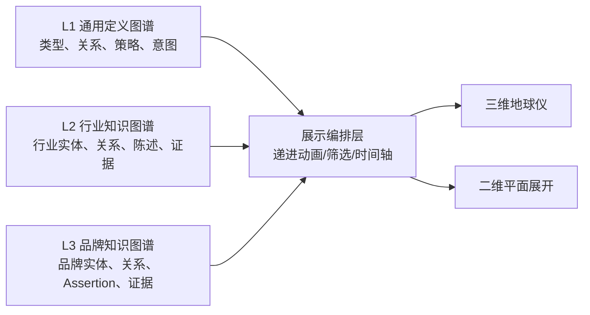

# Brand Atlas 分层知识图谱使用与展示说明

> 当前设计取向：L1、L2、L3 不再做强制跨层联系。每层独立形成知识图谱，可单独导出、单独展示、单独调整；展示层可以按 L1 -> L2 -> L3 递进播放，视觉上做成三维地球仪或二维平面展开。

## 1. 当前工程结论

项目已经具备三层图谱的入库、导出和投影基础，但还不是完整的前端动态地球仪产品。当前更准确的阶段是：

| 能力 | 当前状态 | 说明 |
|---|---|---|
| L1 通用定义层 | 已有 | 通过 YAML/JSON 和 `database/publish.py` 发布到 PostgreSQL 注册表 |
| L2 行业实例层 | 已有 Pipeline | 可从行业 scope、报告和证据生成行业实体、关系、陈述 |
| L3 品牌实例层 | 已有 Pipeline | 可从品牌文档生成品牌实体、关系、Assertion、证据和快照 |
| 分层 JSON 导出 | 已优化 | 新增 `--layer L1/L2/L3`，可分别导出三层 |
| 跨层联动 | 不支持 | L2 与 L3 不建立映射或关系 |
| 三维地球仪/二维展开 | 尚未实现 | 当前只有 JSON/pyvis/Neo4j Browser，后续应新增 Three.js/Mapbox/D3 前端 |

## 2. 新的数据表达原则

不要把三层做成互相写入、互相覆盖的链路，而是做成三套独立图谱数据集，再由展示层负责“递进呈现”。



这里的箭头不是数据依赖或修改联动，而是展示顺序：先看系统规则，再看行业背景，最后看品牌局部知识。

## 3. 每层数据维度

### L1 通用定义层

L1 不是具体事实库，而是“图谱可以长什么样”的定义层。

| 数据维度 | 主要表/文件 | 输出内容 |
|---|---|---|
| L2 本体 | `common_knowledge/ontology/l2_industry/` | 41 种实体、37 种关系、24 项指标 |
| L3 本体 | `common_knowledge/ontology/l3_brand/` | 44 种实体、43 种关系、19 项指标 |
| 意图与问题模式 | `common_knowledge/intents/*.yaml` -> `intent_definition` | 用户搜索/提问意图、决策阶段、问题模板 |
| 来源规则 | `common_knowledge/sources/*.yaml` -> `source_policy` | 来源类型、权威等级、适用范围 |
| 质量和治理策略 | `common_knowledge/policies/*.yaml` -> `quality_rule` 等 | 证据、冲突、晋升、上下文规则 |
| 任务模板 | `common_knowledge/tasks/*.yaml` -> `task_template` | 行业研究、内容 Brief、品牌接入等任务结构 |

L1 导出命令：

```powershell
python -m runtime.visualize.export --layer L1 --out runtime/visualize/output/l1_graph.json
```

### L2 行业知识层

L2 是某个行业或市场的共享行业图谱。它不保存某个客户的内部信息。

| 数据维度 | 主要表/文件 | 输出内容 |
|---|---|---|
| 行业范围 | `industry_scope`、`scopes/*.yaml` | 行业 ID、市场、语言、边界、排除范围 |
| 研究需求 | `industry_requirement` | 14 个标准研究维度、来源要求、报告合同 |
| 报告结构 | `research_report`、`report_section` | 报告路径、章节、覆盖状态 |
| 候选知识 | `report_candidate` | 从报告解析出的候选事实、关系、陈述 |
| 证据链 | `source_instance`、`evidence`、`citation_resolution` | 来源、引用、证据片段、支持状态 |
| 行业实体 | `entity` | industry、category、audience、problem、use_case、capability、decision_factor、topic 等 |
| 行业关系 | `relation` | 行业内实体之间的业务关系 |
| 行业陈述 | `statement` | 有证据支撑的事实、观察、判断 |
| 晋升门禁 | `promotion_gate_results`、`review_queue` | 通过、拒绝、待审核原因 |

L2 标准研究维度目前是 14 个：

| 维度代码 | 含义 |
|---|---|
| `market_definition` | 市场定义和边界 |
| `category_structure` | 品类和子品类结构 |
| `market_participants` | 市场参与者 |
| `audience_and_decision_chain` | 用户角色和决策链 |
| `problems_and_jobs` | 用户问题和任务 |
| `use_cases` | 使用场景 |
| `capabilities` | 产品/行业能力图谱 |
| `decision_factors` | 选型决策因素 |
| `topics_and_questions` | 主题和典型问题 |
| `market_facts_and_trends` | 市场事实和趋势 |
| `regulation_and_risks` | 法规和风险 |
| `competition_structure` | 竞争结构 |
| `source_ecology` | 来源生态 |
| `evidence_gaps` | 证据缺口 |

L2 导出命令：

```powershell
python -m runtime.visualize.export --layer L2 --out runtime/visualize/output/l2_graph.json
python -m runtime.visualize.export --industry crm_software --out runtime/visualize/output/l2_crm_graph.json
```

### L3 品牌知识层

L3 是某个租户、某个品牌的局部品牌图谱。它保存品牌自己是谁、有什么产品、能力、证据、口径和限制。

| 数据维度 | 主要表/文件 | 输出内容 |
|---|---|---|
| 租户边界 | `tenant` | 客户隔离边界 |
| 品牌工作区 | `brand_workspace` | 品牌、市场、语言、默认权限、接入配置 |
| 品牌来源策略 | `brand_source_policy` | 哪些来源可用于该品牌 |
| 原始文档 | `source_instance`、`document`、`document_chunk` | 官网、产品文档、白皮书、页面切片 |
| 品牌实体 | `entity` | brand、organization、product、product_version、capability、certification、content 等 |
| 品牌关系 | `relation` | owns_brand、offers、has_capability、serves、solves 等品牌内部关系 |
| Assertion | `assertion` | 品牌事实、主张、观察、推断 |
| Assertion 证据 | `assertion_evidence`、`evidence` | 每条 Assertion 的证据支持 |
| 产品记录 | `product_record` | 产品版本、部署方式、市场等属性 |
| 口径策略 | `claim_policy` | 允许说、限制说、禁止说 |
| 冲突记录 | `knowledge_conflict` | 命名、版本、数值、范围、来源冲突 |
| 内容资产 | `content_inventory` | 页面、文章、案例、白皮书等资产 |
| 品牌快照 | `brand_snapshot` | 一次发布后的计数和审计锚点 |

L3 全流程不读取 L2，也不创建 L3 到 L2 的映射。

```powershell
# 默认：独立 L3 图谱
python -m runtime.brand.executor --all --file "D:\brand_docs\product.md" --tenant customer_a --brand "示例品牌"

```

L3 导出命令：

```powershell
python -m runtime.visualize.export --layer L3 --out runtime/visualize/output/l3_graph.json
python -m runtime.visualize.export --brand "示例品牌" --tenant <tenant-id> --out runtime/visualize/output/l3_brand_graph.json
```

## 4. 展示层建议

三维地球仪和二维展开不应该直接写数据库，它们只消费导出的 JSON。

| 展示模式 | 推荐实现 | 数据输入 | 交互重点 |
|---|---|---|---|
| 三维地球仪 | Three.js / Globe.gl | `l1_graph.json`、`l2_graph.json`、`l3_graph.json` | 节点围绕球面排布，边用弧线，L1/L2/L3 逐层点亮 |
| 二维平面展开 | D3.js / Cytoscape.js / vis-network | 同上 | 分层平铺、筛选、搜索、节点详情 |
| 递进动画 | 前端状态机 | 三个分层 JSON | L1 基础规则 -> L2 行业结构 -> L3 品牌知识 |
| 单层调整 | 后端 API + 审核队列 | 当前层 JSON + PostgreSQL | 修改只落当前层，不自动改其他层 |

建议展示 JSON 结构继续保持：

```json
{
  "nodes": [],
  "edges": [],
  "statements": [],
  "stats": {"nodes": 0, "edges": 0, "statements": 0}
}
```

后续做地球仪时，只需要在前端给节点追加布局字段，例如：

```json
{
  "id": "node-id",
  "label": "节点名",
  "layer": "L2",
  "lat": 31.2,
  "lng": 121.5,
  "cluster": "capabilities"
}
```

如果节点没有真实地理位置，可以用算法生成虚拟经纬度：按 layer 分纬度带，按 entity_type 分大陆/区域，按关系密度微调位置。

## 5. 本次发现并已优化的问题

| 问题 | 影响 | 已处理方式 |
|---|---|---|
| L3 曾包含跨层映射能力 | 会破坏 L2/L3 独立语义 | 已删除映射 Pipeline、表定义和导出入口 |
| Neo4j 全量投影默认投跨层边 | Neo4j Browser 看到的是联动图，不是独立分层图 | 改为默认不投 mapping，显式参数才投 |
| 缺少单层导出入口 | 前端难以做 L1/L2/L3 递进展示 | 新增 `--layer L1/L2/L3` |

## 6. 下一步优化顺序

1. 先做一个静态前端原型：读取三个 JSON，支持三维地球仪/二维展开切换。
2. 给每个节点补 `display` 元数据：颜色、大小、层级、聚类、虚拟经纬度。
3. 给导出器增加 `--view globe` 和 `--view flat` 的布局预处理。
4. 再做单层编辑 API：L1 改定义、L2 改行业事实、L3 改品牌事实，三者互不自动级联。
5. 最后再考虑 L4 动态反馈层，用事件流记录查询、LLM 输出、人工纠错、采纳结果和知识更新反馈。
