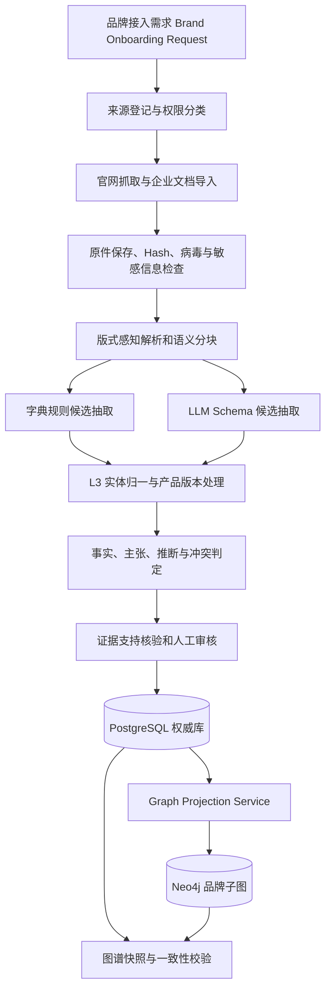

# Brand Atlas Knowledge Graph：第三层品牌认知知识层搭建技术文档

> **版本**：1.0.1
> **状态**：Design Baseline
> **创建日期**：2026-08-11
> **上游依赖**：L1 通用知识层 v1.1.0、L2 行业知识层 v1.0.0
> **试点案例**：DeepCleer 深澈智算
> **适用范围**：任意客户品牌；DeepCleer 只用于验证模型，不属于固定本体

## 1. 文档目的

L3 品牌认知层用于把某个客户品牌的官网、企业知识库、产品资料、案例、资质和经审核的内部信息，转换为可追溯、可版本化、可授权的品牌知识子图。

它不是传统客服问答知识库，也不是把文档切块后等待相似度召回。其核心产物是一个“品牌认知模型”：明确品牌是谁、提供什么产品、服务谁、解决什么问题、具备什么能力、有哪些证据、能够说什么和不能说什么。

当前阶段只解决知识图谱搭建：资料采集、解析、结构化抽取、L3 层内实体归一、证据核验、PostgreSQL 入库、Neo4j 投影、更新和验收。提问词、主题规划、文章优化、Context Builder、检索和 Rerank 属于后续应用阶段，不纳入本文 MVP。

## 2. 核心结论

### 2.1 是否有必要为每个品牌建立独立认知底座

有必要，但不应为每个品牌复制一套技术架构和行业知识。

正确的复用方式是：

```text
共享 L1 方法、本体和规则
        +
共享 L2 行业、品类、用户、问题、能力和决策因素
        +
每个客户独立的 L3 品牌实例、私有证据、品牌口径和内容资产
```

换一个品牌时，只新增一个租户隔离的品牌子图，并将其产品、能力、用户和主题映射到已有 L2 ID。只有遇到 L2 没有的新行业概念时，才发起 L2 候选扩展；只有遇到跨品牌都通用的新语义类型时，才发起 L1 变更。

### 2.2 知识图谱采用什么方法搭建

采用 **Schema-first、Ontology-guided、Assertion-centric Property Graph**：

1. 先由 L1/L2 定义允许抽取的实体、关系和语义约束。
2. 使用文档解析、字典规则和 LLM Schema 抽取生成候选知识。
3. 使用实体归一、版本识别、证据核验和人工审核完成晋升。
4. PostgreSQL 保存权威记录、权限、版本和证据链。
5. Neo4j 保存可重建的属性图投影，用于路径查询、差距分析和上下文组装。
6. Assertion 节点保存“谁在什么时间、基于什么来源、在什么条件下说了什么”。

这不是“让 LLM 从文档自由生成图谱”，也不是直接使用 GraphRAG 的社区聚类摘要替代业务本体。GraphRAG 可作为跨文档主题发现和全局摘要的辅助方法，但不能替代 L1/L2 Schema、证据审核和稳定 ID。

## 3. 四层边界

| 层级 | 保存内容 | L3 如何使用 |
|---|---|---|
| L1 通用知识层 | 实体、关系、意图、任务、证据和冲突规则 | 约束 L3 抽取和输出 |
| L2 行业知识层 | 行业、品类、用户、问题、JTBD、能力、决策因素、竞品公共知识 | L3 引用其稳定 ID，形成行业坐标 |
| L3 品牌认知层 | 品牌、组织、产品、版本、能力映射、品牌主张、案例、资质、内容和内部约束 | 本文范围 |
| L4 动态观测层 | 搜索结果、AI 回答、品牌提及、引用和排名快照 | 用于发现 L3 内容缺口，不反向覆盖 L3 稳定事实 |

L3 应保存：

- 品牌与法律组织的身份、别名、官网和官方联系信息
- 产品、服务、版本、模块、部署方式和集成方式
- 产品到 L2 品类、能力、问题、场景、用户和决策因素的映射
- 品牌定位、价值主张、差异化主张和受控营销口径
- 客户案例、量化结果、资质、认证、POC 和服务承诺
- 官网、白皮书、说明书、FAQ、案例页等内容资产及其主题覆盖
- 内部文档的访问级别、允许使用的任务和发布限制
- 事实、品牌自述、第三方主张、推断和冲突

L3 不应保存：

- 可被所有品牌复用的行业定义和标准能力，应进入 L2
- 单次搜索或 AI 回答，应进入 L4
- 没有来源的模型想象
- 原始客户业务数据、订单明细或个人敏感数据，除非另有受控数据域
- 未经授权可直接进入公开文章的内部资料
- 把品牌宣传语自动升级为客观事实的记录

## 4. 总体架构



### 4.1 多租户隔离

所有 L3 业务记录必须具备 `tenant_id` 和 `brand_id`。其中：

- `tenant_id` 表示客户数据安全边界。
- `brand_id` 表示目标品牌；一个租户可管理多个品牌或子品牌。
- L2 实体为共享只读对象，不携带客户内部信息。
- 跨品牌比较必须显式声明目标品牌和允许比较的品牌集合。
- PostgreSQL 使用 Row Level Security 或应用层强制租户过滤。
- Neo4j 节点保存 `tenant_id`；任何查询模板必须以租户过滤开头。

## 5. 品牌接入需求

每次接入先创建 `Brand Onboarding Request`，不能直接把一批文件扔给抽取模型。

```yaml
request_id: bor_deepcleer_20260811_v1
tenant_id: tenant_example
brand_input:
  canonical_name: DeepCleer
  known_aliases: [深澈智算]
  official_domains: [deepcleer.ai, deepcleer.com.cn]
markets: [CN]
languages: [zh-CN]
industry_scope:
  l2_industry_ids: [ind_enterprise_software, ind_ecommerce_services]
  l2_category_candidates:
    - ecommerce_finance_integration
    - enterprise_settlement
    - enterprise_ai_agent_platform
source_scope:
  official_website: true
  internal_documents: true
  third_party_authoritative: false
  community_sources: false
required_dimensions:
  - identity
  - product_portfolio
  - audience_and_problem
  - capability_and_use_case
  - deployment_and_integration
  - security_and_compliance
  - proof_and_case
  - service_and_poc
  - messaging_and_content
output_policies:
  default_access_level: internal
  public_content_requires_approved_claims: true
```

正式应用中，`brand_input`、行业范围、资料权限和必需维度都由用户或品牌管理员给出。DeepCleer 的 ID、字段或产品名称不得写入通用 Pipeline。

## 6. 来源模型与优先级

### 6.1 来源类型

| 来源类型 | 典型内容 | 默认权威性 | 默认信息类别 | 公开输出 |
|---|---|---:|---|---|
| 企业登记或监管记录 | 法律主体、登记状态 | 高 | fact 候选 | 可 |
| 官方官网 | 品牌名、产品名、联系方式 | 高但有立场 | 可验证属性为 fact；能力与价值为 self_claim | 可，受口径审核 |
| 官方产品文档 | 功能、版本、接口、部署 | 高但有立场 | product_spec 或 self_claim | 按文档权限 |
| 官方认证证书 | 认证编号、范围、有效期 | 高 | fact 候选 | 证书核验后可 |
| 企业内部已批准资料 | 售前口径、实施规则 | 业务权威 | internal_fact 或 self_claim | 默认不可 |
| 企业内部草稿 | 路线图、未发布功能 | 低到中 | draft_claim | 不可 |
| 客户案例和证言 | 使用结果、评价 | 中 | attributed_claim | 经授权可 |
| L2 权威第三方来源 | 行业标准、独立报告 | 高或中 | fact / third_party_claim | 依来源许可 |
| 搜索结果 | 页面发现、排名 | 低 | observation | 进入 L4 |

社区网站和普通 UGC 当前不属于 L3 采集范围。若未来启用，必须作为低权威 `observation/user_review` 隔离，不能与官方资料混合晋升。

### 6.2 来源优先级不是覆盖优先级

更新、更官方的资料可作为当前展示优先项，但不得覆盖历史记录。冲突处理遵循：

```text
识别是否为同一主体、谓词、产品版本和适用条件
→ 能用版本或时间解释：建立 supersedes/validity，不视为错误
→ 能用客户层级或部署方案解释：保留两个条件化 Assertion
→ 仍无法解释：创建 Conflict，进入人工审核
```

### 6.3 权限字段

每个 `Document`、`Chunk`、`Evidence` 和 `Assertion` 至少保存：

```text
access_level: public | internal | confidential | restricted
allowed_task_types: [...]
allowed_output_channels: internal_analysis | customer_report | public_content
contains_pii: boolean
contains_trade_secret: boolean
embargo_until: timestamp | null
owner_department: string | null
```

权限必须沿证据链向下游传播。公开网页不能引用只由 `confidential` 证据支持的结论。

## 7. L3 数据域和抽取维度

### 7.1 品牌与组织身份域

抽取字段：

- 品牌规范名、中文名、英文名、历史名和常见写法
- 法律组织名、品牌与组织的所有或运营关系
- 官方域名、登录域名、地区、地址、电话和邮箱
- 品牌描述、成立时间、总部和团队信息
- 商标或品牌层级：集团品牌、公司品牌、产品品牌、子品牌

关键规则：`Organization`、`Brand` 和 `Product` 必须分开。一个公司可运营多个品牌，一个品牌可包含多个产品，一个产品也可能拥有独立产品品牌。

### 7.2 产品组合与版本域

抽取字段：

- 产品和服务名称、别名、产品线、模块和套餐
- 产品状态：planned、beta、active、deprecated
- 产品版本、发布时间、文档版本和适用版本
- 部署方式：SaaS、私有化、本地、混合、桌面端
- 定价模式、试用、POC 和购买方式
- 产品依赖、可选模块和第三方集成

产品版本不能只存在于文档文件名中。能力可能在不同版本发生变化，因此版本级断言必须指向 `ProductVersion` 或在 Assertion 的 `scope.product_version` 中明确限定。

### 7.3 定位与品类映射域

抽取字段：

- 品牌自定义产品类别和一句话定位
- L2 规范行业、品类和替代方案类型
- 核心市场、地域、企业规模和业务复杂度
- 与 ERP、BI、自研系统等替代路径的关系
- 品牌希望被关联或避免关联的概念

品牌原话作为 `self_claim` 保存；品类归一使用 L2 定义，二者不能互相覆盖。

### 7.4 用户、决策链和 JTBD 域

抽取字段：

- 使用者、业务负责人、技术评估者、采购者、审批者和受益者
- 企业画像：行业、规模、业务模式、平台数量、组织复杂度
- 用户问题、严重程度、触发事件和现有替代方式
- Job to Be Done、期望结果、验收指标和决策因素
- 决策阶段：认知、问题识别、方案探索、比较、决策、实施、续用

优先引用 L2 `Audience`、`Problem`、`JobToBeDone`、`Outcome` 和 `DecisionFactor` ID。品牌资料只补充“该品牌声称服务这些对象”的映射和适用条件。

### 7.5 能力、功能和使用场景域

三类概念必须区分：

| 概念 | 问题 | 示例 |
|---|---|---|
| Capability | 产品具备什么稳定能力 | 多主体合并核算 |
| Feature | 产品界面或模块如何实现 | 一键生成合并报表 |
| UseCase | 谁在什么情境下用它完成什么任务 | 集团财务月结时抵消内部交易 |

抽取字段：

- 品牌原始功能名和 L2 规范能力 ID
- 能力状态、产品版本、部署条件和依赖
- 输入、处理、输出和边界条件
- 支持的使用场景、解决的问题和产生的结果
- 可核验方式：文档、演示、测试、客户案例或第三方证据

不允许仅因文档出现相似关键词就建立 `HAS_CAPABILITY`。至少需要一句直接支持能力存在的 Evidence Span，并记录产品版本和限制条件。

### 7.6 技术、部署和集成域

抽取字段：

- 架构组件、数据存储、计算引擎和模型类型
- API、RPA、文件、ERP、OA、财务系统和电商平台集成
- 私有化、公有云、本地桌面端和混合部署
- 数据规模、并发、响应时间和历史数据范围
- 可用性、备份、恢复、扩缩容和厂商依赖
- 已验证性能与仅承诺性能的区分

技术栈名称可作为事实候选；性能数字若只来自品牌资料，仍为带测试条件的 `self_claim`。

### 7.7 安全、合规和权限域

抽取字段：

- 数据访问控制、行列权限、角色权限和租户隔离
- 加密、审计日志、数据保留和删除策略
- 安全认证、证书编号、范围、颁发方和有效期
- 数据是否离开客户环境，模型训练和推理位置
- 适用法律、会计准则和监管要求
- 安全能力与部署方案的依赖关系

“支持等保三级”与“已通过等保三级”语义不同；认证事实必须能追溯到证书或可验证登记，不得根据营销页自动认定。

### 7.8 证据、案例和量化结果域

抽取字段：

- 客户案例主体、行业、规模、场景和授权状态
- 使用前基线、使用后结果、时间窗口、样本和测量方法
- 性能测试、POC 结果、客户证言和第三方测评
- 证书、奖项、专利、合作伙伴和媒体报道
- 可公开程度、是否匿名、是否允许引用客户名称

量化结果必须拆成结构化值：

```json
{
  "metric": "month_close_duration",
  "before": {"value": 10, "unit": "day"},
  "after": {"value": 5, "unit": "day"},
  "population": "one referenced customer scenario",
  "measurement_period": null,
  "methodology": null,
  "statement_class": "self_claim",
  "publishability": "public_with_attribution"
}
```

缺少样本、时间或方法不妨碍保存主张，但会降低证据等级，并禁止改写成普遍结果。

### 7.9 实施、服务和商业域

抽取字段：

- 试用、POC、实施阶段、周期、客户配合项和验收标准
- 历史数据迁移、培训、上线保障和售后渠道
- SLA、响应时间、到场时间和服务时段
- 部署和服务定价模式，不保存无授权的具体报价
- 适合和不适合的客户、前置条件和退出机制

服务承诺按产品套餐、客户等级、合同版本和有效期限定，不能生成全局无条件事实。

### 7.10 品牌信息与内容资产域

抽取字段：

- 标准品牌介绍、一句话定位、价值主张和差异化主张
- Approved Claim：允许公开使用的口径
- Restricted Claim：只能内部分析的口径
- Prohibited Claim：禁止使用或需要法务确认的口径
- 语气、术语、产品标准名、旧名称和禁用名称
- 官网页面、文章、白皮书、FAQ、案例、视频和下载资料
- 每个内容资产覆盖的 L2 主题、问题、用户、意图和决策阶段

内容资产不是证据的同义词。一篇内容可包含多个 Evidence Span；同一 Evidence Span 可支持多个受条件限制的 Assertion。

### 7.11 竞争映射域

L3 只保存与目标品牌有关的竞争映射和品牌口径；竞品公共事实尽量引用 L2。

抽取字段：

- 直接竞品、间接竞品、替代方案和自研路径
- 竞争发生的品类、用户、预算、地区和决策因素
- 品牌自述的差异化和独立证据的比较结论
- 不可比较项和版本差异

同一篇对比材料中共同出现，不足以建立 `COMPETES_WITH`。需证明二者在同一需求、预算或采购决策中形成替代。

## 8. 文档从原始资料到知识的处理逻辑

### 8.1 来源登记

每份资料在读取前创建 `source_instance` 和 `document`：

```text
source_id、tenant_id、brand_id、source_type、publisher
canonical_url 或 external_path、retrieved_at、published_at
document_version、language、mime_type、content_hash
access_level、allowed_task_types、license、owner
```

文件名不是文档版本的唯一依据。需同时解析封面、页眉、元数据和正文版本号，并保留冲突。

### 8.2 原件保存和门禁

处理步骤：

1. 保存原始文件或网页快照，计算 SHA-256。
2. 检查 MIME 类型、病毒、密码保护和文件损坏。
3. 识别 PII、商业秘密、合同和未发布路线图。
4. 确认来源域名、跳转链、发布日期和网页 canonical URL。
5. 相同 Hash 幂等跳过；相同 URL 不同 Hash 进入新文档版本。
6. 不满足权限或版权要求的资料只登记元数据，不进入解析。

### 8.3 版式感知解析

不同文档采用不同解析器：

| 文档 | 主要方法 | 输出结构 |
|---|---|---|
| HTML | DOM 主体提取、标题层级、表格和链接解析 | page/section/block/link |
| PDF | 文本层提取 + 页面渲染；扫描件补 OCR | page/heading/paragraph/table/figure |
| Word/Markdown | 标题、段落、列表、表格和批注解析 | section/block/table |
| PPT | 页标题、文本框、表格、图注和讲者备注 | slide/block/figure |
| Excel | Sheet、表头、单元格类型、公式和数据区域 | sheet/table/row/cell |

PDF 和 PPT 中的架构图不能只依赖文本层。解析结果需保留页码、边界框、表格行列和图片引用，以便证据回溯。

### 8.4 语义分块

分块优先级：

```text
产品或文档版本
→ 章节
→ 子标题
→ 表格或列表
→ 段落
→ 句子级 Evidence Span
```

禁止固定字符数切块破坏表格和问答结构。推荐：

- `Section Chunk`：用于章节级抽取和实体消歧，约 300 至 900 中文字。
- `Evidence Span`：直接支持一条陈述的最小连续原文，通常 1 至 5 句或一行表格。
- `Context Window`：Evidence Span 前后相邻块，用于消歧，不直接作为引用。

### 8.5 候选抽取

采用三路并行候选：

1. **字典和规则**：品牌名、产品名、URL、版本号、日期、金额、单位、认证编号、联系方式、表格字段。
2. **LLM Schema 抽取**：用户、问题、JTBD、能力、场景、关系、主张、限制和隐含条件。
3. **版式和结构抽取**：标题归属、FAQ 问答、能力矩阵、对比表、流程图、产品架构图。

LLM 的抽取维度必须预先由 `Extraction Profile` 固定。模型可以提出 `unknown_candidate`，但不能自行创建新的实体类型或关系类型。

示例 Profile：

```yaml
profile_id: l3_capability_mapping_v1
applies_to_sections: [product_positioning, core_capabilities, technical_highlights]
allowed_entity_types: [product, capability, use_case, problem, outcome]
allowed_relation_types:
  - has_capability
  - capability_supports_use_case
  - solves
  - produces_outcome
required_assertion_fields:
  - subject_ref
  - predicate
  - object_ref_or_value
  - statement_class
  - evidence_span
  - product_version_scope
  - limitations
reject_if:
  - no_direct_evidence
  - product_identity_ambiguous
  - capability_only_inferred_from_category
```

### 8.6 实体归一和消歧

按以下顺序执行：

1. 精确 ID 或官网 canonical URL 匹配。
2. 租户内规范名和受控别名匹配。
3. 产品所属品牌、品类、域名、版本和上下文约束匹配。
4. L2 词典、SKOS `prefLabel/altLabel` 和同义词匹配。
5. 向量或编辑距离只用于生成实体匹配候选，不建设面向下游内容任务的向量召回。
6. LLM 对候选解释匹配理由和差异。
7. 品牌、组织、产品和认证等高风险实体由人工确认。

实体合并阈值不采用单一相似度。推荐特征：

```text
规范名 0.25 + 别名 0.15 + 官方域名 0.20 + 所属主体 0.15
+ 品类 0.10 + 版本兼容 0.10 + 上下文 0.05
```

品牌和产品不得仅凭向量相似度自动合并。

### 8.7 L3 层内归一

品牌、产品、能力、客群和问题只在 L3 Profile 内完成实体消歧与归一：

```text
品牌产品名 → L3 Product
品牌原始能力名 → L3 Capability
品牌目标客户描述 → L3 Audience
品牌痛点描述 → L3 Problem
产品定位 → L3 Brand Positioning
```

归一结果只引用 L3 实体，不查询或保存 L2 实体 ID。

### 8.8 事实、主张和推断判定

判定核心不是“来源是否官方”，而是“陈述能否独立验证，以及来源是否对结果有利益关系”。

| 陈述 | 分类 |
|---|---|
| 官网列出的官方品牌名、域名和当前产品名 | fact 候选，标注 official_source |
| 官网声称支持某能力 | self_claim；通过产品测试或独立资料后可形成 verified fact |
| 内部说明书描述未公开路线图 | internal_claim 或 internal_fact，禁止公开输出 |
| 客户说结账从 10 天降到 5 天 | attributed_claim，保留客户、样本和授权条件 |
| 模型根据功能推断适合某类客户 | inference，保存前提，不进入稳定能力事实 |
| 某日搜索结果出现品牌 | observation，进入 L4 |

系统还应增加 `assertion_kind`：

```text
identity_fact
product_spec
self_claim
attributed_claim
third_party_fact
internal_fact
draft_claim
inference
```

`statement_class` 继续使用 L1 的 fact/claim/observation/inference；`assertion_kind` 负责 L3 更细的业务语义。

### 8.9 支持关系核验

每条候选陈述必须回答：

- 原文是否直接表达该陈述，而非只谈同一主题？
- 主体是否正确，是品牌、产品还是具体版本？
- 谓词是否被条件、否定或未来时态限定？
- 数值的单位、样本、时间和测试环境是否完整？
- 证据是否有权限用于当前任务和输出渠道？

输出 `support_status`：`direct`、`partial`、`context_only`、`contradictory`、`not_found`。只有 `direct` 或经人工接受的 `partial` 可晋升。

### 8.10 审核与晋升

```text
candidate
→ normalized
→ evidence_verified
→ policy_checked
→ approved
→ active
```

以下情况强制人工审核：

- 认证、合规、安全、税务和会计准则相关陈述
- “唯一、首个、领先、最全、最准”等绝对化主张
- 性能、ROI、客户结果和市场地位数值
- 竞品比较和替代建议
- 内部资料转为公开口径
- 产品名、产品版本或来源之间存在冲突
- L2 新实体和新能力映射

## 9. 图谱实体和关系

### 9.1 核心实体

| 实体 | 归属 | 用途 |
|---|---|---|
| Organization | L1 变更候选 | 法律或运营主体 |
| Brand | L1 已有 | 品牌身份 |
| Product | L1 已有 | 可独立购买或使用的产品/服务 |
| ProductVersion | L1 变更候选 | 能力与口径的版本边界 |
| Audience | 引用 L2 | 使用、影响和决策角色 |
| Problem | 引用 L2 | 用户问题 |
| JobToBeDone | 引用 L2 | 目标任务 |
| Outcome | 引用 L2 | 期望结果 |
| Category | 引用 L2 | 规范品类 |
| Capability | 引用 L2 为主 | 行业共享能力 |
| UseCase | 引用 L2 为主 | 使用情境 |
| DecisionFactor | 引用 L2 | 选型维度 |
| Topic | 引用 L2 | 内容主题 |
| Content | L1 已有，L3 实例 | 官网页、说明书、案例和 FAQ |
| Fact/Claim | L1 已有，存储为 Assertion | 带证据和条件的陈述 |
| Source | L1 已有 | 来源主体和载体 |

`Document`、`Chunk`、`Evidence`、`Assertion`、`Conflict`、`ReviewTask` 和 `ContextPackage` 属于知识工程存储对象，不要求都进入 L1 业务本体。

### 9.2 核心关系

```text
Organization -[OWNS_BRAND]-> Brand
Brand -[OFFERS]-> Product
ProductVersion -[VERSION_OF]-> Product
ProductVersion -[SUPERSEDES]-> ProductVersion
Brand -[OPERATES_IN]-> L2 Industry
Product -[BELONGS_TO]-> L2 Category
Product -[HAS_CAPABILITY]-> L2 Capability
Product -[SUPPORTS_USE_CASE]-> L2 UseCase
Product -[SOLVES]-> L2 Problem
Product -[SERVES]-> L2 Audience
L2 Capability -[CAPABILITY_SUPPORTS_USE_CASE]-> L2 UseCase
L2 Audience/Category -[HAS_DECISION_FACTOR]-> L2 DecisionFactor
Content -[COVERS]-> L2 Topic
Product/Brand -[COMPETES_WITH]-> L2 Brand/Product
Assertion -[SUPPORTED_BY]-> Evidence
Assertion -[CONTRADICTS]-> Assertion
```

产品的决策因素通过 `Product → Category/Audience → DecisionFactor` 路径获得，不直接创建违反 L1 类型约束的 `Product → HAS_DECISION_FACTOR` 关系。

高频直接边用于查询，真实语义和证据仍由 Assertion 表达。例如：

```text
(:Product)-[:HAS_CAPABILITY {assertion_id, status, valid_from}]->(:Capability)

(:Assertion {statement_class:'claim', access_level:'public'})
  -[:SUBJECT]->(:Product)
  -[:OBJECT]->(:Capability)
  -[:SUPPORTED_BY]->(:Evidence)
```

## 10. PostgreSQL 权威存储

L3 的目标实现复用 L2 规划的 `source_instance`、`document`、`document_chunk`、`entity`、`entity_alias`、`relation`、`statement`、`evidence`、`review_queue` 和 `graph_outbox`，并增加品牌域表。当前根目录 `database/schema.sql` 仍是 L1 定义注册库，这些 L2/L3 业务表尚需单独迁移实现。

### 10.1 建议表

| 表 | 用途 |
|---|---|
| tenant | 客户租户 |
| brand_workspace | 品牌接入范围和默认权限 |
| brand_source_policy | 该品牌允许使用的来源和输出渠道 |
| product_record | 产品、服务和版本属性 |
| assertion | 统一事实、主张和推断 |
| assertion_evidence | Assertion 与 Evidence 多对多关系 |
| knowledge_conflict | 版本、数值、定义和来源冲突 |
| claim_policy | 品牌允许、限制和禁止的表述 |
| content_inventory | 内容资产、主题覆盖和发布状态 |
| brand_snapshot | 可复现的品牌知识快照 |

### 10.2 关键 DDL

```sql
CREATE TABLE brand_workspace (
  id UUID PRIMARY KEY,
  tenant_id UUID NOT NULL,
  brand_entity_id UUID NOT NULL REFERENCES entity(id),
  market VARCHAR(20) NOT NULL,
  language VARCHAR(20) NOT NULL,
  default_access_level VARCHAR(20) NOT NULL,
  onboarding_request JSONB NOT NULL,
  status VARCHAR(20) NOT NULL,
  created_at TIMESTAMPTZ NOT NULL DEFAULT NOW(),
  updated_at TIMESTAMPTZ NOT NULL DEFAULT NOW(),
  UNIQUE (tenant_id, brand_entity_id, market, language)
);

CREATE TABLE assertion (
  id UUID PRIMARY KEY,
  tenant_id UUID NOT NULL,
  brand_id UUID NOT NULL,
  subject_id UUID NOT NULL REFERENCES entity(id),
  predicate VARCHAR(80) NOT NULL,
  object_entity_id UUID REFERENCES entity(id),
  object_value JSONB,
  statement_text TEXT NOT NULL,
  statement_class VARCHAR(20) NOT NULL,
  assertion_kind VARCHAR(30) NOT NULL,
  claimant_id UUID,
  scope JSONB NOT NULL DEFAULT '{}'::jsonb,
  limitations JSONB NOT NULL DEFAULT '[]'::jsonb,
  verification_status VARCHAR(30) NOT NULL,
  publication_status VARCHAR(30) NOT NULL,
  access_level VARCHAR(20) NOT NULL,
  confidence NUMERIC(4,3),
  valid_from TIMESTAMPTZ,
  valid_to TIMESTAMPTZ,
  supersedes_id UUID REFERENCES assertion(id),
  status VARCHAR(20) NOT NULL,
  created_at TIMESTAMPTZ NOT NULL DEFAULT NOW(),
  updated_at TIMESTAMPTZ NOT NULL DEFAULT NOW(),
  CHECK (statement_class IN ('fact','claim','observation','inference')),
  CHECK (object_entity_id IS NOT NULL OR object_value IS NOT NULL)
);

CREATE TABLE assertion_evidence (
  assertion_id UUID NOT NULL REFERENCES assertion(id),
  evidence_id UUID NOT NULL REFERENCES evidence(id),
  support_status VARCHAR(20) NOT NULL,
  support_reason TEXT,
  verifier_version VARCHAR(100),
  PRIMARY KEY (assertion_id, evidence_id)
);

CREATE TABLE claim_policy (
  id UUID PRIMARY KEY,
  tenant_id UUID NOT NULL,
  brand_id UUID NOT NULL,
  assertion_id UUID REFERENCES assertion(id),
  normalized_phrase TEXT,
  policy_type VARCHAR(20) NOT NULL,
  allowed_channels JSONB NOT NULL,
  required_qualifiers JSONB NOT NULL DEFAULT '[]'::jsonb,
  approval_owner TEXT,
  effective_from TIMESTAMPTZ,
  effective_to TIMESTAMPTZ,
  status VARCHAR(20) NOT NULL
);
```

### 10.3 约束和索引

- `entity` 的业务唯一性使用 `tenant_id + entity_type + normalized_name + owner_id`，不能只用名称。
- `assertion` 建立 `tenant_id, brand_id, subject_id, predicate, status` 复合索引。
- JSONB 中高频字段如 `product_version`、`market`、`deployment_type` 应生成列或表达式索引。
- 当前 MVP 不建设 PostgreSQL FTS、pgvector 或独立搜索索引；原文块只用于抽取、证据核验和实体消歧。
- 所有更新采用 append + supersedes，不物理覆盖证据。
- 用 RLS 强制 `tenant_id = current_setting('app.tenant_id')`。

## 11. PostgreSQL 到 Neo4j

PostgreSQL 是唯一权威源；Neo4j 是可删除、可重建的查询投影。

### 11.1 节点投影

```text
entity organization      → :Entity:Organization
entity brand             → :Entity:Brand
entity product           → :Entity:Product
entity product_version   → :Entity:ProductVersion
L2 shared entity         → :Entity:<L2Label> {scope:'shared'}
assertion                → :Assertion
evidence                 → :Evidence
document                 → :Document
source_instance          → :Source
content_inventory        → :Content
knowledge_conflict       → :Conflict
```

### 11.2 同步条件

只有满足以下条件的记录才投影为可用图关系：

```text
status = active
verification_status in (verified, approved_claim)
valid_from <= snapshot_time
valid_to is null or valid_to >= snapshot_time
tenant and access policy valid
relation/entity type通过 L1 白名单
```

未审核主张可投影为 `Assertion` 供内部分析，但不能物化成供公开内容直接读取的高置信直接边。

### 11.3 同步方式

```text
PostgreSQL 事务提交
→ graph_outbox 追加事件
→ Projection Worker 按 stable UUID 幂等 MERGE
→ 更新 Assertion、证据链和直接边
→ 写入 processed_at
→ 数量、孤立节点、权限和抽样一致性校验
```

直接关系属性至少包含：

```text
assertion_id, tenant_id, brand_id, verification_status,
publication_status, confidence, valid_from, valid_to, snapshot_id
```

查询使用参数化 Cypher。实体和关系 Label 只允许从白名单映射，不能将数据库字符串直接拼接到 Cypher。

### 11.4 示例查询

查询某品牌产品对某类用户的“问题、能力、证据”路径：

```cypher
MATCH (b:Brand {id: $brand_id, tenant_id: $tenant_id})-[:OFFERS]->(p:Product)
MATCH (p)-[hc:HAS_CAPABILITY]->(c:Capability)<-[:REQUIRES_CAPABILITY]-(u:UseCase)
MATCH (p)-[:SERVES]->(a:Audience)-[:HAS_PROBLEM]->(problem:Problem)
WHERE hc.verification_status IN ['verified', 'approved_claim']
  AND hc.snapshot_id = $snapshot_id
RETURN p, c, u, a, problem, hc.assertion_id
LIMIT $limit;
```

## 12. 当前阶段交付边界

当前阶段的终点是“可审核、可查询、可重建的品牌知识图谱”，具体交付包括：

- 品牌接入需求和来源清单
- 原始资料、解析文档、语义块和 Evidence Span
- 规范实体、别名、关系、Assertion、冲突和缺失信息
- L3 品牌实体层内归一结果
- PostgreSQL 权威数据和品牌知识快照
- Neo4j 节点、Assertion 证据链和高频物化关系
- 自动质量报告、人工审核记录和 PostgreSQL/Neo4j 一致性报告

Context Builder、向量召回、混合检索、Rerank、Token 预算、任务 Profile、提问词、主题规划和文章优化明确列为后续项目，不作为当前图谱搭建的设计、开发或验收项。

## 13. 更新和变化检测

### 13.1 首次构建

首次以品牌官网和企业提供的完整知识包为主：

```text
接入需求冻结
→ 全站 URL 清单和企业文件清单
→ 文档解析和抽取
→ L3 层内实体归一
→ 冲突清单
→ 品牌管理员审核
→ 发布 brand_snapshot_v1
```

### 13.2 增量更新

| 数据 | 建议频率 | 更新触发 |
|---|---|---|
| 官网产品页、定价、FAQ | 每日或每周变化检测 | HTML Hash 或关键区块变化 |
| 产品说明书和版本说明 | 新版本上传触发 | 文档版本或 Hash 变化 |
| 案例、新闻和资质 | 每周发现 | 新 URL、证书到期或新闻发布 |
| 内部产品口径 | 审批流事件触发 | 产品、销售或法务批准 |
| 品牌主题和内容覆盖 | 每周或发布后 | 新内容发布、旧页面删除 |

更新流程保存语义 Diff：新增、修改、删除、版本变化、权限变化和证据变化。页面消失不等于事实立即失效，应进入 `needs_review` 并保留历史证据。

### 13.3 快照

每次发布生成 `brand_snapshot`：

```text
snapshot_id、tenant_id、brand_id、l1_version、l2_snapshot_id
source_manifest_hash、entity_count、assertion_count、conflict_count
approved_by、published_at、previous_snapshot_id
```

每次抽取、审核、Neo4j 投影和质量验收都记录使用的 `brand_snapshot_id`，确保图谱可以复现和回滚。

## 14. DeepCleer 试点映射

### 14.1 本次资料清单

| 来源 | 可见版本/日期 | 权限判断 | 主要用途 |
|---|---|---|---|
| `https://www.deepcleer.ai/` | 2026-08-11 抓取 | public | 当前公开品牌、产品、能力、FAQ 和联系信息 |
| 官网 AI 业财财报平台详情 | 2026-08-11 抓取 | public | 产品定位、能力、场景和 POC |
| 官网智能结算系统详情 | 2026-08-11 抓取 | public | 第二产品线和结算能力 |
| 官网 AI 智能体构建工厂详情 | 2026-08-11 抓取 | public | 智能体产品线；需与 DCCLaw 名称消歧 |
| `DeepCleer_QA_V2.1.pdf` | 文件名 V2.1；封面 V2.0 AI 增强版 | confidential | 售前问答、性能、实施、ROI、竞品和 POC 主张 |
| `智算云图-DeepCleer-深澈智算 V2006.03.pdf` | 页尾日期 2026-05-07 | internal | 公司、架构、能力、服务和认证主张 |
| `DeepCleer 深澈智算 - 产品说明书.md` | 未见明确版本 | internal，待确认 | 详细产品设计和能力口径 |

QA 文件名与封面版本不一致，必须创建 `document_version_conflict`，不能默认选择 V2.1 或 V2.0。

### 14.2 实体样例

```text
Organization: 上海智算云图科技有限公司
  OWNS_BRAND → Brand: DeepCleer / 深澈智算

Brand: DeepCleer
  OFFERS → Product: AI业财财报平台
  OFFERS → Product: 智能结算系统
  OFFERS → Product: DCCLaw桌面智能体
  OFFERS → ProductCandidate: AI智能体构建工厂
```

`DCCLaw桌面智能体` 与 `AI智能体构建工厂` 不能自动合并。官网首页把 DCCLaw 描述为桌面本地控制台，产品详情页则描述低代码多智能体开发平台。应先建立 `possible_same_product` 候选，由产品负责人确认是同一产品的命名演进、不同版本，还是两条产品线。

### 14.3 产品能力映射样例

| 品牌原始表述 | L2 能力候选 | Assertion 分类 | 证据状态 |
|---|---|---|---|
| 全平台账单自动拉取 | 多源数据采集 | self_claim | 官网和内部材料一致 |
| SKU/虚拟店铺分摊 | 多维成本费用分摊 | self_claim | 官网、QA、说明书一致 |
| 三大表与合并报表 | 财务报表生成、合并核算 | self_claim | 多个官方来源支持 |
| 静态归档与审计追踪 | 审计追溯 | self_claim | 多个官方来源支持 |
| Doris 万亿级实时计算 | 大规模实时分析 | quantified self_claim | 缺独立测试条件 |
| AI Agent 自然语言查数 | 自然语言数据查询 | self_claim | 官网和 QA 支持 |
| 多主体资金分发 | 企业资金结算 | self_claim | 官网智能结算产品页支持 |
| 多模型、多 Agent、Skills、MCP | 智能体编排与工具扩展 | self_claim | 官网 DCCLaw/智能体页面支持 |

多个官方来源一致可以提高“品牌口径一致性”，但不能自动把能力主张变成第三方验证事实。

### 14.4 发现的冲突和限定项

| 问题 | 处理方式 |
|---|---|
| 目标规模出现月 GMV 1000 万以上、5000 万+已验证、年 GMV 1 亿以上 | 分成适用阈值、验证案例和目标画像三个谓词；不做数值覆盖 |
| 店铺建议出现 50 家以上和 100 家以上 | 建立条件化 Assertion 和冲突记录，待产品负责人确认当前口径 |
| QA 文件名 V2.1，封面写 V2.0 | 保留两种版本信号并人工确认 |
| DCCLaw 与 AI 智能体构建工厂的定位不同 | 不自动合并产品实体 |
| P0 15 分钟电话响应与 30 分钟故障响应 | 按 SLA 类型、客户等级和材料版本拆分，待确认公开口径 |
| “全行业首个、最全最准、唯一” | 绝对化 self_claim，默认禁止公开复用，除非有独立证据和法务批准 |
| 等保三级、ISO 27001、ISO 27701 | 官方认证主张；需证书编号、范围和有效期核验后晋升 fact |
| 释放 5 至 8 个 HC、节省 100 万+/年 | 量化 self_claim；仅适用于材料中的参考客户假设 |
| 客户评价为匿名展示 | attributed_claim；不得推断客户身份或普遍效果 |

### 14.5 示例 Assertion

```json
{
  "subject": "product_deepcleer_finance",
  "predicate": "has_capability",
  "object": "l2_cap_multi_entity_consolidation",
  "statement_text": "DeepCleer 官方资料称其支持多法人合并及内部交易抵消。",
  "statement_class": "claim",
  "assertion_kind": "self_claim",
  "claimant": "brand_deepcleer",
  "scope": {
    "market": "CN",
    "product_version": null,
    "accounting_context": "enterprise_ecommerce"
  },
  "verification_status": "official_consistent_unverified",
  "publication_status": "approved_with_attribution",
  "access_level": "public",
  "evidence_refs": [
    "ev_site_finance_consolidation",
    "ev_qa_page_6_q7"
  ]
}
```

### 14.6 DeepCleer 当前试点的缺失信息

- 品牌与公司法律关系的正式登记或商标依据
- 各产品的正式产品边界、当前版本和命名策略
- 能力上线状态、套餐差异和部署条件
- 认证证书编号、认证主体、认证范围和有效期
- 性能测试环境、数据规模定义、并发和响应时间统计方法
- ROI 案例的客户样本、时间窗口和计算方法
- 公开可引用客户案例及授权范围
- 当前 SLA、套餐和客户等级的对应关系
- 产品路线图中“即将上线”能力的当前状态
- 对竞品名称和比较材料的法务批准口径

这些缺失项应输出为 `missing_information`，不能由模型补齐。

## 15. Skills 与 Tools

### 15.1 逻辑 Skills

| Skill | 责任 |
|---|---|
| brand_scope_compiler | 把用户指定品牌和需求编译为接入范围 |
| official_site_inventory | 枚举官网 URL、产品页、FAQ、案例、新闻和下载项 |
| enterprise_document_ingestion | 导入企业 PDF、Word、PPT、Markdown 和 Excel |
| layout_aware_parser | 保留页码、标题、表格和图示关系 |
| brand_entity_extraction | 按 Profile 抽取品牌、产品、版本和内容实体 |
| entity_resolver | 在 L3 Profile 内归一品牌实体和能力 |
| assertion_classifier | 判定 fact、claim、observation 和 inference |
| evidence_verifier | 验证 Evidence Span 是否直接支持陈述 |
| entity_resolution | 品牌、组织、产品、别名和版本消歧 |
| claim_governance | 管理 Approved、Restricted 和 Prohibited Claims |
| brand_graph_publisher | 审核后写 PostgreSQL 并投影 Neo4j |
| brand_change_monitor | 官网和文档版本变化检测 |

### 15.2 工具

| 类别 | 推荐工具能力 |
|---|---|
| 官网采集 | Playwright、站点地图解析、robots/限速、HTML 快照和 DOM Diff |
| 文档解析 | PDF 文本与渲染、OCR、DOCX/PPTX/XLSX 结构解析 |
| 原件存储 | S3/MinIO/对象存储、SHA-256 和版本清单 |
| 结构化抽取 | 支持 JSON Schema/Structured Output 的 LLM |
| 数据质量 | JSON Schema、SHACL 风格约束、规则引擎和人工审核台 |
| 主存储 | PostgreSQL、RLS、JSONB 和事务迁移 |
| 图分析 | Neo4j 和参数化 Cypher |
| 调度 | Airflow、Dagster、Temporal 或现有任务系统 |
| 观测 | OpenTelemetry、任务日志、抽取模型和 Prompt 版本记录 |
| 安全 | 病毒扫描、DLP、密钥管理、访问审计和脱敏 |

正式系统应把 Skill 定义为可版本化的业务步骤，把 Tool 定义为可替换实现。例如 `layout_aware_parser` 可先用一种 PDF 解析器，未来更换工具不改变上层数据契约。

## 16. L1 是否需要修改

需要，但建议作为 **L1 v1.2.0 最小增量** 单独评审，不阻塞 L3 MVP。

### 16.1 必需变更

| 类型 | 建议 | 原因 |
|---|---|---|
| 实体 | 新增 `organization` | 当前 `brand` 同时承担法律主体和品牌，无法表达一公司多品牌 |
| 实体 | 新增 `product_version` | 产品能力、定价、命名和限制随版本变化 |
| 关系 | 新增 `owns_brand` | 表达 Organization → Brand |
| 关系 | 新增 `offers` | 当前缺少 Brand → Product 的明确关系 |
| 关系 | 新增 `version_of` | 表达 ProductVersion → Product |
| 关系 | 新增 `supersedes` | 表达版本和口径的替代链 |

### 16.2 推荐变更

- 在 `brand_onboarding.yaml` 增加 `tenant_id`、权限、产品版本、来源清单、层内归一、冲突和缺失信息输出。
- 在 `context_policy.yaml` 增加 `product_id`、`product_version`、`output_channel`、`publication_status` 和 `allowed_task_types` 硬过滤。
- 在 `claim_policy.yaml` 增加 `internal_fact`、`product_spec`、`draft_claim` 和 `approved_claim` 的处理说明。
- 在冲突策略中新增 `naming_conflict`、`document_version_conflict`、`sla_conflict` 和 `scope_conflict`。
- 修正根数据库 `schema.sql` 仍描述 15 实体/20 关系的旧版注释与初始化清单；当前它尚不是 L2/L3 业务实例库。

### 16.3 MVP 兼容方式

在 L1 v1.2 发布前：

- `organization` 暂存为 L3 `entity.semantic_subtype=organization`。
- `product_version` 暂存为 `product` 且 `semantic_subtype=product_version`。
- 新关系进入 `relation_candidate`，审核后再物化；不要复用语义不正确的旧关系。
- L3 文档、Assertion、权限和证据表可先实现，因为它们属于存储模型，不要求进入 L1 业务本体。

## 17. MVP 实施计划

### 阶段 1：DeepCleer 单品牌闭环

1. 建立品牌接入需求和来源登记。
2. 解析三份企业资料和官网产品页。
3. 建立品牌、组织、产品和内容资产实体。
4. 完成 30 至 50 个核心能力到 L2 的映射候选。
5. 生成事实、主张、冲突和缺失信息清单。
6. 人工确认产品命名、版本、公开口径和权限。
7. 发布首个 PostgreSQL 品牌快照并投影 Neo4j。

### 阶段 2：跨品牌复用验证

1. 接入第二个不同类型品牌，验证无 DeepCleer 硬编码。
2. 统计 unmapped L2 概念和本体缺口。
3. 发布 L1 v1.2 和必要的 L2 分类扩展。
4. 增加官网变化检测、内部审批流和自动刷新。

## 18. 验收标准

- 新品牌只需提交接入需求和资料清单，不需修改 Pipeline 代码。
- 100% L3 记录具备 `tenant_id`、`brand_id`、来源和访问级别。
- 100% 对外可用 Assertion 具备直接证据、有效期和发布状态。
- 品牌、组织、产品和版本不因名称相似而误合并。
- 产品能力归一到 L3 实体 ID，并保留消歧依据。
- 内部机密证据不会出现在公开内容 Context Package。
- 官网、QA、说明书冲突不会被自动覆盖或合并。
- PostgreSQL 可完整重建 Neo4j，Neo4j 故障不影响权威写入。
- 图谱构建任务可通过 snapshot ID 复现相同实体、关系和 Assertion 集合。
- 第二个品牌接入时，DeepCleer 专有产品名和能力不会成为通用 Schema 字段。

## 19. 参考依据

- [Schema.org Organization](https://schema.org/Organization)
- [Schema.org Brand](https://schema.org/Brand)
- [Schema.org Product](https://schema.org/Product)
- [W3C PROV-O](https://www.w3.org/TR/prov-o/)
- [W3C SKOS](https://www.w3.org/TR/skos-reference/)
- [W3C SHACL](https://www.w3.org/TR/shacl/)
- [Microsoft GraphRAG](https://microsoft.github.io/graphrag/)
- [Neo4j Graph Data Science](https://neo4j.com/docs/graph-data-science/current/)
- [PostgreSQL Row Security Policies](https://www.postgresql.org/docs/current/ddl-rowsecurity.html)
- [DeepCleer 官网](https://www.deepcleer.ai/)
- [DeepCleer AI 业财财报平台](https://www.deepcleer.ai/product-detail.html?product=smart-reconciliation)
- [DeepCleer 智能结算系统](https://www.deepcleer.ai/product-detail.html?product=ai-settlement-hub)
- [DeepCleer AI 智能体构建工厂](https://www.deepcleer.ai/product-detail.html?product=ecommerce-agent-platform)

## 20. 变更记录

| 版本 | 日期 | 变更 |
|---|---|---|
| 1.0.1 | 2026-08-11 | 收紧当前范围为 L3 知识图谱搭建；移除 Context Builder、混合召回、Rerank、Token 预算和下游任务设计 |
| 1.0.0 | 2026-08-11 | 建立通用 L3 技术基线；用 DeepCleer 官网和三份企业资料完成试点映射、冲突分析和 L1 v1.2 变更建议 |
