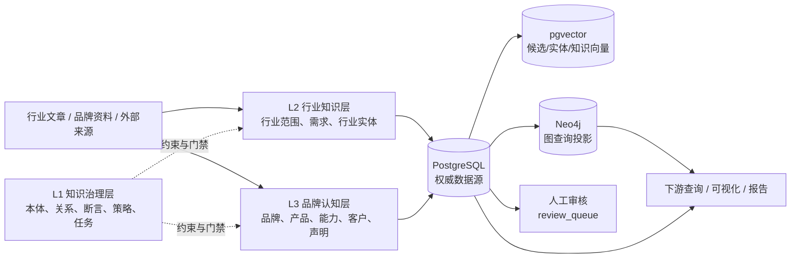
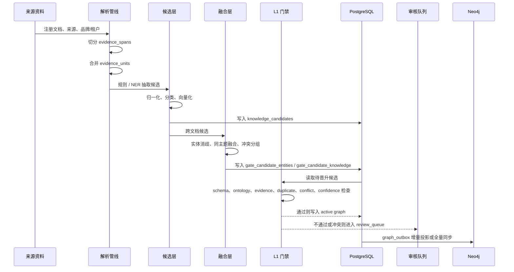

# Brand Atlas 旧版系统说明

## 一句话定义

旧版 Brand Atlas 是一个面向企业知识管理的“分层知识图谱构建与治理后台”。

它的核心目标不是直接和用户聊天，而是把行业文章、品牌资料等非结构化内容，经过证据切分、候选知识抽取、实体消歧、冲突检测、人工审核和知识晋升，最终形成可查询、可追溯、可投影到 Neo4j 的知识图谱。

旧版的设计更接近数据生产管线和知识治理平台，而不是独立桌面软件。

## 总体架构



## 旧版的核心组成

### 1. L1 知识治理层

L1 不直接负责导入文章，而是负责定义“什么知识是合法的、如何处理、如何审核”。

主要内容包括：

- 实体类型和关系类型
- 断言类型、上下文和决策阶段
- 任务模板、示例案例和操作协议
- 来源策略、质量规则和知识晋升策略
- 多租户、品牌工作区和访问级别约束

主要实现和数据定义位于：

- `legacy/database/schema.sql`
- `legacy/database/publish_l1.py`
- `common_knowledge/`
- `shared/knowledge/registry.py`

当前项目已经把不少 L1 定义重新整理到了 `common_knowledge/` 和 `shared/`，但新版尚未把完整的治理流程接入桌面界面。

### 2. L2 行业知识层

L2 用于构建相对稳定的行业知识，例如行业范围、市场需求、行业问题、行业能力和行业关系。

旧版 L2 是一套独立流水线：

```mermaid
flowchart LR
    A[行业文章] --> B[article_registration\n文章建档]
    B --> C[content_parsing\n正文解析]
    C --> D[evidence_unit_merge\n证据单元合并]
    D --> E[candidate_extraction\n候选抽取]
    E --> F[candidate_normalization\n候选归一化]
    F --> G[candidate_vectorization\n候选向量化]
    G --> H[knowledge_fusion\n跨文档融合与冲突分组]
    H --> I[promotion\nL1 门禁与知识晋升]
    I --> J[active graph / review_queue]
```



编排入口是 [legacy/industry/executor.py](../../legacy/industry/executor.py)，旧版默认执行顺序在该文件的 `ALL_ORDER` 中定义。

### 3. L3 品牌认知层

L3 面向具体品牌，处理品牌官网、产品介绍、客户案例、能力说明和品牌声明等资料。

L3 与 L2 逻辑上分开，旧版默认流水线比 L2 多一个敏感内容提醒步骤：

```mermaid
flowchart LR
    A[品牌资料] --> B[document_registration\n来源与品牌建档]
    B --> C[sensitive_content_warning\n敏感内容扫描]
    C --> D[content_parsing\n结构化解析]
    D --> E[evidence_unit_merge\n证据单元合并]
    E --> F[candidate_extraction\n规则/NER 候选抽取]
    F --> G[candidate_normalization\n候选归一化]
    G --> H[candidate_vectorization\n候选向量化]
    H --> I[knowledge_fusion\n跨文档融合]
    I --> J[promotion\n门禁、冲突与晋升]
    J --> K[品牌活动图谱 / 人工审核]
```



编排入口是 [legacy/brand/executor.py](../../legacy/brand/executor.py)。敏感内容提醒本身由 [legacy/brand/pipelines/sensitive_content_warning.py](../../legacy/brand/pipelines/sensitive_content_warning.py) 实现，原则上只提醒、不直接阻断后续处理。

## 一份资料在旧版中如何流转



## 旧版最重要的机制

### 证据溯源

旧版不是抽取出一个实体就直接丢进图谱，而是保留：

```text
source_instance
    → document
        → evidence_spans
            → evidence_units
                → knowledge_candidates
                    → gate_candidate_knowledge
                        → active graph
```

候选知识通常会记录来源文档、证据单元、原文片段、发布时间、来源 URL 和置信度。

### 跨文档融合

旧版 [legacy/fusion/fusion_service.py](../../legacy/fusion/fusion_service.py) 主要处理四类情况：

- **融合**：同一个主语、谓词和宾语的候选合并为一条知识
- **冲突**：同一主语和谓词对应不同宾语，保留为冲突候选，交给审核
- **补充**：同一个实体的不同属性分别保留
- **跨实体建联**：同名或别名实体进行消歧和归并

融合结果不会马上成为正式知识，而是先写入 `gate_candidate_entities` 和 `gate_candidate_knowledge`。

### L1 门禁与晋升

旧版 [legacy/promotion/promotion_service.py](../../legacy/promotion/promotion_service.py) 会依次检查：

1. `gate_schema`：知识结构是否完整
2. `gate_ontology`：实体类型、关系类型和 domain/range 是否符合本体
3. `gate_evidence`：是否有足够且支持该知识的证据
4. `gate_duplicate`：是否和已有活动知识重复
5. `gate_conflict`：是否和已有知识冲突
6. `gate_confidence`：置信度是否达到策略阈值

通过后才会写入 `entity`、`relation`、`statement` 或 `assertion`；失败或冲突的候选会进入 `review_queue`。

### PostgreSQL + Neo4j 双存储

旧版的 PostgreSQL 是权威数据源，Neo4j 是可重建的查询投影：

- PostgreSQL 保存完整的来源、证据、候选、审核和活动知识
- `graph_outbox` 保存图谱变更事件
- Neo4j 根据 outbox 增量同步，或执行全量重建
- `legacy/neo4j/consistency.py` 用于比较 PostgreSQL 和 Neo4j 的数量及样本一致性

投影实现位于 [legacy/neo4j/projection.py](../../legacy/neo4j/projection.py)。

## 旧版的主要数据域

旧版数据库比当前 SQLite 版本复杂得多，主要包含：

| 数据域 | 典型表 | 作用 |
|---|---|---|
| L1 治理 | `entity_type`、`relation_type`、`quality_rule`、`task_template` | 定义知识规则和运行约束 |
| 来源与文档 | `source_instance`、`document`、`content_inventory` | 记录来源、版本、访问级别和内容状态 |
| 证据与候选 | `evidence_spans`、`evidence_units`、`knowledge_candidates` | 保存抽取过程和溯源信息 |
| 融合门禁 | `gate_candidate_entities`、`gate_candidate_knowledge` | 保存待审核的中间知识 |
| 活动图谱 | `entity`、`relation`、`statement`、`assertion` | 保存正式知识 |
| 治理结果 | `review_queue`、`knowledge_conflict` | 保存人工审核和冲突记录 |
| 品牌域 | `tenant`、`brand_workspace`、`product_record`、`brand_snapshot` | 管理租户、品牌、产品和快照 |
| 向量域 | `candidate_embedding`、`gate_entity_embedding`、`gate_knowledge_embedding`、`entity_embedding` | 支持候选消歧、融合和检索 |
| 投影域 | `graph_outbox` | 驱动 Neo4j 同步 |

完整旧版结构见 [legacy/database/l2_l3_schema.sql](../../legacy/database/l2_l3_schema.sql)。

## 旧版的外围能力

旧版还提供了若干非主流程工具：

- `legacy/clients/ner_client.py`：可选 NER 服务和本地 NER 适配
- `legacy/clients/embeddings.py`：外部 Embedding，以及预留的本地模型模式
- `legacy/core/metrics.py`：抽取数量、重复率、晋升数、审核数、证据验证和向量覆盖率统计
- `legacy/visualize/export.py`：按 L1/L2/L3、行业、品牌或全部数据导出 JSON
- `legacy/visualize/knowledge_graph.ipynb`：旧版 Notebook 图谱查看
- `legacy/migrations/`：旧 PostgreSQL 数据库迁移入口
- `legacy/docker-compose.yml`：PostgreSQL、Neo4j 等旧版基础设施

## 与当前新版的关系

当前新版不是把旧版 PostgreSQL/Neo4j 源码原封不动搬过来，而是重新实现了一条适合桌面软件的本地链路：

```text
Tauri 窗口
    → React 前端
        → FastAPI 本地 Sidecar
            → SQLite
                → shared 抽取规则 / 本体
                → 可选外部 LLM / Embedding API
```

新版已经保留旧版的核心思想：

- 证据优先
- 候选知识先产生，再归一化和融合
- 实体、关系和来源保留本地溯源
- LLM 与 Embedding 可以独立启用
- LLM 不可用时，单个单元才回退到规则抽取

但新版当前采用的是更轻量的产品路径：

- 不再依赖 PostgreSQL、Neo4j 和 Docker
- 使用 SQLite 保存本地数据
- L2/L3 统一为一个可配置的知识层
- 导入后直接构建本地实体和关系
- 暂未实现旧版完整的 Gate、人工审核、冲突治理和 Neo4j 投影
- 桌面端以“知识库对话 + 图谱查看”为主要入口

因此，旧版可以理解为“知识图谱生产与治理后台”，当前新版可以理解为“本地优先的知识工作台”。`legacy/` 仅作为历史参考，不属于当前运行时。

## 相关源码入口

- [legacy/industry/executor.py](../../legacy/industry/executor.py)：L2 行业流水线编排
- [legacy/brand/executor.py](../../legacy/brand/executor.py)：L3 品牌流水线编排
- [legacy/fusion/fusion_service.py](../../legacy/fusion/fusion_service.py)：跨文档融合和冲突分组
- [legacy/promotion/promotion_service.py](../../legacy/promotion/promotion_service.py)：L1 门禁和知识晋升
- [legacy/neo4j/projection.py](../../legacy/neo4j/projection.py)：PostgreSQL 到 Neo4j 投影
- [legacy/visualize/export.py](../../legacy/visualize/export.py)：旧版图谱导出
- [legacy/core/metrics.py](../../legacy/core/metrics.py)：旧版质量与构建指标
